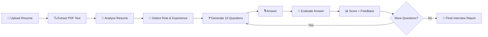
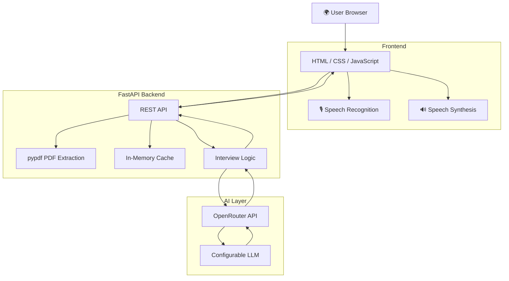
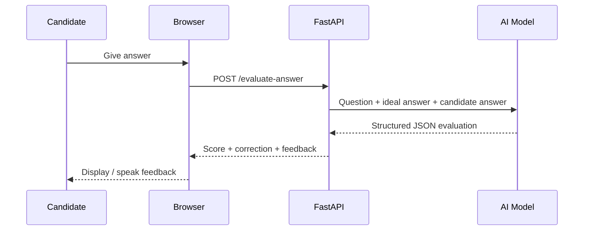

# 🤖 ResumeSync AI — Interview Roast Bot

<p align="center">
  <strong>Turn a resume into a personalized interview.</strong><br/>
  Upload a resume, get role-aware questions, answer naturally, and receive AI-powered feedback.
</p>

<p align="center">
  
  
  
  
</p>

---

## 📌 Overview

**ResumeSync AI** is an AI-powered mock interview platform built to make interview preparation more personalized and practical.

A candidate uploads a **PDF resume**. The system extracts the resume text, identifies the candidate's likely **professional role, field, specialization, and experience level**, and then generates personalized interview questions based on the information found in the resume.

During the interview, candidates can type their answers or use browser-based speech recognition. The AI evaluates each answer for **content, correctness, relevance, reasoning, and completeness**, then provides concise feedback and a corrected explanation when needed.

The goal is simple: **practice with questions that are actually relevant to your background instead of generic interview questions.**

---

## ✨ Key Features

| Feature | Description |
|---|---|
| 📄 Resume Upload | Upload a PDF resume directly from the browser |
| 🧠 Role Detection | Identifies role, field, specialization, and experience level |
| 🎯 Personalized Questions | Generates questions from the candidate's actual resume |
| 🧑‍💻 Role-Aware Interview | Technical questions are used only when relevant to the candidate's field |
| 🎙️ Voice Answers | Uses the browser's speech recognition capability |
| 🔊 Text-to-Speech | Reads interview questions and feedback aloud |
| 📊 Answer Scoring | Scores answers on a 0–10 scale |
| ✅ Error Detection | Highlights factual or conceptual mistakes |
| 💡 Corrected Explanation | Shows what a stronger explanation should contain |
| 🏁 Session Summary | Calculates total score, percentage, and question-level results |
| ⚡ Async Backend | Uses asynchronous AI calls for better responsiveness |
| 🗃️ Lightweight Cache | Avoids repeating analysis for the same resume during a single backend instance |

---

## 🧭 Interactive Architecture

GitHub renders the Mermaid diagrams below directly.

### Candidate Flow



### System Architecture



### Answer Evaluation



---

## 🖥️ How It Works

### 1. Upload
The candidate uploads a PDF resume.

### 2. Analyze
The backend extracts readable text using **pypdf** and sends the relevant content to the AI layer.

### 3. Build the Interview
The system identifies:

- Professional role
- Professional field
- Specialization
- Experience level
- Confidence
- Evidence used for the identification

It then generates **10 interview questions** and an ideal/reference answer for each question.

### 4. Conduct the Interview
Questions are displayed one at a time.

Candidates can:
- ⌨️ Type an answer
- 🎙️ Speak an answer
- 🔊 Listen to the question

### 5. Evaluate the Answer
The AI checks the **meaning and correctness of the response**, rather than requiring exact wording.

The evaluation can include:

```text
Score: 8/10
Correctness: Mostly Correct

What was correct:
...

Error in explanation:
...

Correct explanation:
...

Spoken feedback:
...
```

### 6. Finish the Session
At the end, the application returns:

- Total score
- Maximum score
- Percentage
- Number of questions
- Question-by-question results

---

## 🧱 Tech Stack

| Layer | Technology |
|---|---|
| Frontend | HTML5, CSS3, JavaScript |
| Backend | Python + FastAPI |
| PDF Processing | pypdf |
| AI SDK | OpenAI Python SDK |
| AI Gateway | OpenRouter |
| Voice Input | Web Speech API |
| Voice Output | Speech Synthesis API |
| Configuration | python-dotenv |
| Development | Python virtual environment + Git/GitHub |

---

## 📁 Project Structure

```text
ResumeAnalyser/
├── frontend/
│   ├── index.html
│   ├── script.js
│   └── style.css
├── resumeanalyser.py
├── requirements.txt
├── start_resume_app.bat
├── testatsresume/
├── .gitignore
└── README.md
```

---

## 🔌 API

### `GET /`

Health check.

### `POST /analyze-resume`

Accepts a PDF resume and returns:

- Filename
- Extracted resume text
- Role information
- Interview questions
- Whether the resume text was truncated

### `POST /evaluate-answer`

Evaluates one interview answer using:

- Question
- Ideal answer
- Candidate answer

### `POST /evaluate-session`

Evaluates an entire interview session and returns:

- Per-question scores
- Total score
- Maximum score
- Percentage
- Question count

---

## 🚀 Run Locally

### 1. Clone the repository

```bash
git clone https://github.com/monipk/ResumeAnalyser.git
cd ResumeAnalyser
```

### 2. Create a virtual environment

Windows PowerShell:

```powershell
python -m venv .venv
.\.venv\Scripts\Activate.ps1
```

### 3. Install dependencies

```powershell
pip install fastapi uvicorn[standard] python-multipart python-dotenv pypdf openai
```

### 4. Create `.env`

Create the file in the project root:

```env
OPENROUTER_API_KEY=your_key_here
OPENROUTER_MODEL=google/gemini-2.5-flash-lite
OPENROUTER_TEMPERATURE=0.3
OPENROUTER_TIMEOUT=60

MAX_PDF_BYTES=8388608
MAX_RESUME_CHARS=20000
MAX_ANSWER_CHARS=6000
MARKS_PER_QUESTION=10

CORS_ORIGINS=*
```

> 🔐 **Never commit `.env` or expose your API key in frontend JavaScript.**

### 5. Start the backend

```powershell
uvicorn resumeanalyser:app --host 0.0.0.0 --port 8000
```

Backend health check:

```text
http://127.0.0.1:8000/
```

FastAPI documentation:

```text
http://127.0.0.1:8000/docs
```

### 6. Open the frontend

The current frontend is configured for local development and uses:

```text
http://127.0.0.1:8000
```

for the API.

---

## 🔐 Security & Production Notes

This repository is currently best suited to development, demos, and controlled testing.

Before public production use, consider adding:

- 🔑 Authentication and session management
- 🛡️ Rate limiting and abuse protection
- 🔒 Restricted CORS origins instead of `*`
- ☁️ Secure resume storage and automatic deletion policies
- 🗄️ Persistent database storage
- 📈 Monitoring and structured logging
- 💰 AI usage limits / billing controls
- 🧹 Stronger file validation and privacy controls

The backend already includes size limits for uploaded PDFs, extracted resume text, and candidate answers.

---

## 📊 Scoring Model

Each answer is evaluated on a **0–10 scale**:

| Score | Meaning |
|---:|---|
| 9–10 | Correct and complete |
| 7–8 | Mostly correct with minor missing detail |
| 5–6 | Partially correct with an important gap |
| 3–4 | Mostly incorrect |
| 0–2 | Incorrect or unrelated |

The evaluator focuses on the **content of the answer**, not the candidate's grammar, accent, filler words, or exact wording.

---

## 🧠 Design Decisions

### Dynamic role detection
The model is instructed to infer the professional field from resume evidence instead of assuming every candidate is a software engineer.

### Personalized interview generation
Questions are based on information actually present in the resume, including skills, projects, experience, responsibilities, education, and certifications.

### Content-focused evaluation
The evaluator checks factual and conceptual meaning instead of trying to compare the candidate's wording character-for-character against the reference answer.

### Async processing
The backend uses asynchronous AI requests. Complete session evaluation uses concurrent processing to reduce unnecessary client-side round trips.

### Lightweight caching
Repeated analysis of identical extracted resume text can be served from an in-memory cache during a single backend instance.

---

## 🗺️ Roadmap

- [ ] Job description input
- [ ] Resume + job-description matching
- [ ] Interview mode selection
- [ ] Difficulty selection
- [ ] ATS compatibility analysis
- [ ] Interview history
- [ ] User authentication
- [ ] Persistent database
- [ ] Production deployment
- [ ] Analytics dashboard
- [ ] Multi-language interviews
- [ ] More advanced voice analysis

---

## 🤝 Contributing

Contributions and ideas are welcome.

```text
Fork → Create feature branch → Make changes → Test → Pull Request
```

Please keep pull requests focused and include a short explanation of the change.

---

## 📌 Project Status

**Current status:** Functional prototype / development project 🚧

The core resume analysis, interview generation, voice interaction, answer evaluation, and final scoring flow are implemented. Public production deployment and persistent user data are planned next.

---

## 👨‍💻 Project

Built with Python, FastAPI, JavaScript, and AI technologies.

**ResumeSync AI — AI Interview Studio** 🚀

> Practice smarter. Understand your mistakes. Walk into interviews better prepared.
